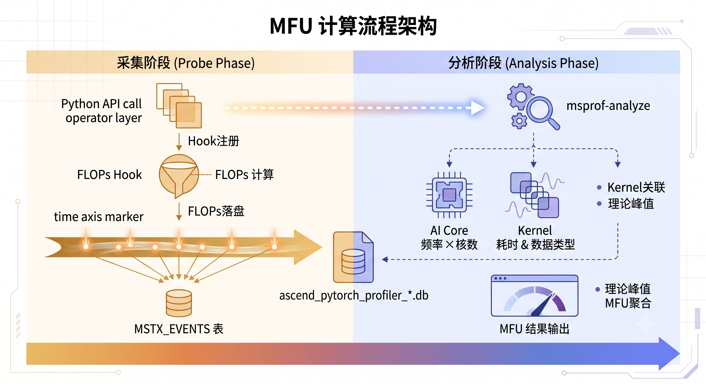
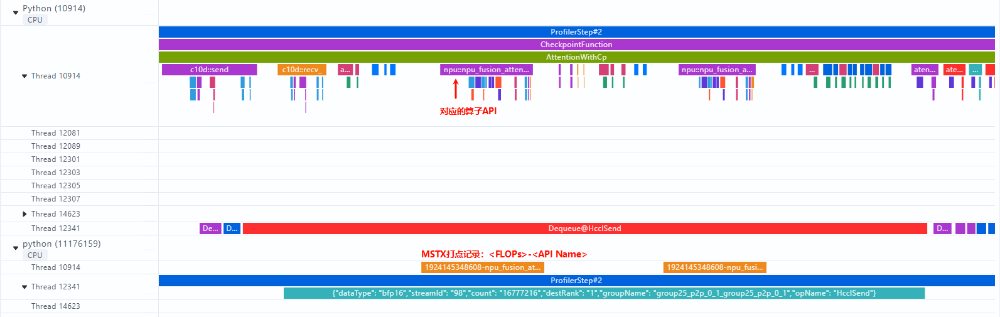
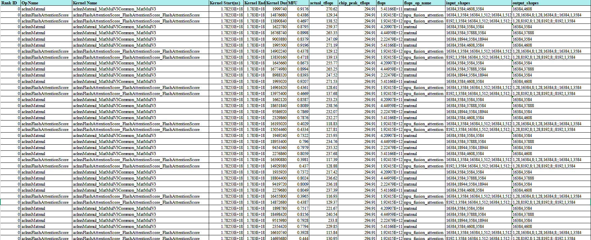
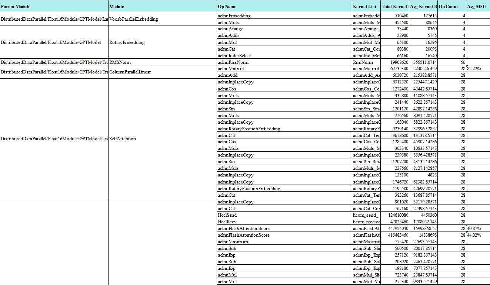

# 使用 torch_npu.profiler 获取算子MFU

## 背景与挑战

MFU（Model FLOPs Utilization）是衡量模型在 NPU 上计算效率的关键指标。简单来说，它回答了一个核心问题：芯片的理论算力，实际发挥出了多少？具体到某个算子，MFU 可以用来评估当前这个算子是否充分利用了算力，有没有必要将几个小算子合并成融合算子。

MFU 的公式本身不复杂：

```Bash
MFU = 实际 FLOPS / 硬件理论峰值 FLOPS = 浮点运算次数（FLOPs）/（执行时间 × 芯片理论峰值）
```

几个核心概念：

- FLOPs（Floating Point Operations）：浮点运算次数，描述总计算量的单位。

- FLOPS（Floating Point Operations Per Second）：每秒浮点运算次数，衡量硬件性能的指标，FLOPS =  FLOPs / 执行耗时

- 执行时间：算子在 device 上的实际运行耗时，可以从 profiling 中拿到。

- 硬件理论峰值算力：由三部分决定——AI Core 数量 × 主频 × 每拍浮点运算次数。以 Cube 单元（FP16）为例，每个时钟周期可完成 `16 × 16 × 16 × 2` 次浮点运算。AI Core 数量与主频均记录在 `device/info.json` 中，可以直接读取对应字段计算得到。

**MFU 计算的真正难点在于：这一次调用到底做了多少次有效浮点运算（FLOPs）？**

一方面，不同算子之间的 FLOPs 计算方式差异很大，很难用一套统一的公式去覆盖所有场景；另一方面，很多算子的计算公式非常复杂，不能简单通过 kernel 名称或 tensor shape 推算出来，需要结合更多入参信息才能确定实际的计算量。以 `npu_fusion_attention` 为例，它的计算量和入参强相关，同样的 API，不同参数下 FLOPs 可能差出几个数量级：

- `input_layout` 不同，shape 中各维度的含义就变了。`TND` 下 sequence 维度是 packed 后的总 token 数，而 `BNSD` 下 batch、head、seq 是分开的

- `sparse_mode` 非 0 时，实际参与计算的 attention score 元素会显著减少

- `actual_seq_qlen` / `actual_seq_kvlen` 决定变长场景下每条样本的真实长度

同一个 kernel 名称背后，对应的实际计算量可能千差万别，而设备侧无法反推这些高层语义。所以我们选择在框架侧做文章，在调用发生的那一刻，拿到真实的入参，把 FLOPs 算出来并存入Profiling数据。

## 通过Profiling工具获得算子 MFU

### 流程解析

**整个方案分为采集和分析两段：**采集时计算FLOPs并通过mstx打点的形式落盘到Profiling数据，分析阶段将上述框架侧的打点和Device上运行的算子关联起来，拿到对应的算子耗时，进而计算出MFU。



**采集阶段由torch_npu.profiler 完成**。用户在打开 `with_flops=True` 及相关配置后，torch_npu 在启动时会安装 Python 层的 FLOPs hook，将已注册公式的目标 API 包装起来。当这些算子被调用时，hook 在真正执行前根据当前入参算出 FLOPs，再通过MSTX接口将结果打点到 `mfu_flops` 域中，最终落盘到 profile 数据并导出为 `ascend_pytorch_profiler_{rank_id}.db`文件，相关信息记录在`MSTX_EVENTS`表中。



**分析阶段由 ****`msprof-analyze`**** 工具承载**。执行 `msprof-analyze -m operator_mfu` 后，工具会从 DB 中读取`MSTX_EVENTS`，解析出每条记录对应的 FLOPs 和算子名称。同时，通过框架API到Device Kernel的关联关系，拿到对应的Device kernel 的执行耗时、输入数据类型。芯片理论峰值则从 device 信息中读取 `ai_core_num` 和 `aic_frequency`，再结合数据类型估算得出。最后，将 FLOPs range 时间窗内的 kernel 与对应的 FLOPs 关联，逐个计算出 MFU。


### 使用指南

#### 第一步：配置 profile 并采集

关键配置项：

- `with_flops=True`：开启 FLOPs 统计

- `experimental_config` ：`mstx=True`允许通过 mstx 打点

- `export_type` ：包含 `Db`，后处理需要读取 DB 中的 `MSTX_EVENTS`

- `profiler_level` ：推荐 `Level1` 及以上，便于基于shapes信息汇总、归类

最小可用示例：

```Python
import torch
import torch_npu

experimental_config = torch_npu.profiler._ExperimentalConfig(
    profiler_level=torch_npu.profiler.ProfilerLevel.Level1,
    aic_metrics=torch_npu.profiler.AiCMetrics.PipeUtilization,
    mstx=True, # 必须为True
    export_type=[
        torch_npu.profiler.ExportType.Text,
        torch_npu.profiler.ExportType.Db,  # 必须包含 Db
    ],
)

prof = torch_npu.profiler.profile(
    activities=[
        torch_npu.profiler.ProfilerActivity.CPU,
        torch_npu.profiler.ProfilerActivity.NPU,
    ],
    with_flops=True, # 必须为True
    experimental_config=experimental_config,
    on_trace_ready=torch_npu.profiler.tensorboard_trace_handler("./result"),
)

prof.start()
# 运行你的模型
prof.stop()
```

#### 第二步：执行分析

```Bash
# 导出文本结果
msprof-analyze -m operator_mfu -d ./result --export_type text
```

#### 第三步：结果解读

`operator_mfu` 会输出两类结果：

- Kernel 级 MFU：每个有效 kernel 一条记录，重点关注以下字段：

  - `flops`：该 kernel 关联的理论计算量

  - `kernel_duration`：实际执行耗时

  - `actual_tflops`：实际达到的 TFLOPS

  - `chip_peak_tflops`：芯片理论峰值

  - `mfu`：最终利用率



- Module 级 MFU（如果打了 Module domain）：按模型层级聚合，便于定位哪一层整体效率偏低。




解读思路：

- `flops` 很大但 `mfu` 很低 → 这个算子理论工作量不小，但没有把芯片算力吃满，有优化空间

- `actual_tflops` 接近 `chip_peak_tflops` → 这类 kernel 已经接近硬件理论上限

- 按照算子类型、shapes等信息聚类，看看哪些 kernel 是真正拖后腿的


## 已支持的算子列表

以下按类别列出当前 hook 方案支持的 API，即 `torch_npu/profiler/_flops_formulas.py` 中通过 `@register_npu_flop` 注册的算子。

统一口径说明：

- 矩阵乘按 multiply\-add 计为 2 次浮点运算

- 融合算子通常只统计主计算部分（GEMM / Attention 主体）

- 通信、reshape、transpose、bias、scale、mask、softmax、dropout、量化/反量化、激活等附带操作，不额外计入

### 通用矩阵乘类

| API | 公式 |
|-----|------|
| `torch.mm` | `2 × M × K × N` |
| `torch.bmm` | `2 × B × M × K × N` |
| `torch.matmul` | 按向量/矩阵/broadcast batch 解析，通用场景为 `2 × prod(batch_shape) × M × K × N` |
| `torch.nn.functional.linear` | `2 × prod(input.shape[:-1]) × out_features × in_features` |
| `torch.addmm` | `2 × M × K × N`（只算 matmul 主体，不单独计 add） |

### NPU GEMM / Grouped GEMM / GMM 类

| API | 公式 |
|-----|------|
| `torch_npu.npu_all_gather_base_mm` | `2 × m_local × world_size × K × N` |
| `torch_npu.npu_transpose_batchmatmul` | 按 perm 还原参与 GEMM 的维度后，计 `2 × M × K × N` |
| `torch_npu.npu_grouped_matmul` | 按 group 分组累加，每组 `2 × M_i × K_i × N_i` |
| `torch_npu.npu_quant_matmul_gelu` | 只算 matmul：`2 × M × K × N` |
| `torch_npu.npu_grouped_matmul_swiglu_quant_v2` | 只算 matmul：`2 × M × K × N` |
| `torch_npu.npu_alltoallv_gmm` | `flops(gmm) + flops(optional mm)` |
| `torch_npu.npu_gmm_alltoallv` | `flops(gmm) + flops(optional mm)` |

### Attention 类

| API | 公式 |
|-----|------|
| `torch_npu.npu_fusion_attention` | `2 × attention_score_elems × (q_dim + v_dim)`，按 `input_layout`、`sparse_mode`、`actual_seq` 分情况计算 |
| `torch_npu.npu_fused_infer_attention_score` | 同上，额外区分 `num_heads` 与 `num_key_value_heads` |
| `torch_npu.npu_block_sparse_attention` | `2 × score_elems × (q_dim + v_dim)`，`score_elems` 由 `block_sparse_mask` 决定 |


## 如何扩展新的算子

这套方案充分考虑了扩展性，如果需要分析的算子还不在当前支持的列表中，也可以按需自定义添加。从采集\-解析的完整链路来看，扩展工作只涉及 `torch_npu.profiler` 侧的采集代码，`msprof-analyze` 的解析逻辑完全不需要改动——只要`mstx range` 的 message 格式保持 `<FLOPs>-<op_name>`、`domain=mfu_flops`就能自动识别和计算 MFU。所以新增一个算子的 FLOPs 支持，只需要在 PTA 侧注册并实现对应的计算公式。

### 第一步：确认目标 API

在 `_flops_formulas.py` 中，注册格式为：

```Bash
@register_npu_flop(target="模块路径:属性名", is_default=True)
```

此处要求能通过 `target` 参数找到对应的 Python 对象，并将其替换为带 FLOPs 计算的 wrapper，例如：

- `torch:mm`

- `torch.nn.functional:linear`

- `torch_npu:npu_fusion_attention`

### 第二步：写公式函数

在 `_flops_formulas.py` 中新增公式函数，入参签名尽量贴近真实 API：

```Python
@register_npu_flop(target="torch_npu:my_new_op", is_default=True)
def my_new_op_flops(x, weight, *, transpose=False, group_list=None, **kwargs):
    # 根据真实入参计算 FLOPs
    m, k = x.shape[-2], x.shape[-1]
    n = weight.shape[-1]
    return 2 * m * k * n
```

注意事项：

- 公式函数只做 FLOPs 计算，不要有副作用

- 用 `**kwargs` 兜底可选参数，避免版本差异导致 wrapper 失败

- 遇到不合法 shape 可以直接抛异常，hook 层会捕获并跳过该次打点

写公式之前，先确认好口径：

- 统计的是主计算，还是包含 bias/activation/quant 等融合部分？

- 稀疏场景下，算理论满量还是有效计算量？

- 变长 / packed 场景下，真实工作量如何从入参恢复？

### 第三步：验证落盘

改完后，需要做以下三项验证：

1. **确认 hook 生效：**目标 API 被调用时，wrapper 确实执行了（可以在公式函数里加日志临时验证）

2. **确认打点落盘：**导出的 DB 中 `MSTX_EVENTS` 表里能看到 `domain='mfu_flops'` 的记录，message 格式为 `<正整数FLOPs>-<op_name>`

3. **确认结果正确：**`msprof-analyze -m operator_mfu` 的输出结果与手动验算能对上（可选取简单场景，如 `torch.mm`，手动算出 FLOPs 再比对工具输出的 `flops` 字段


## 总结

MFU 作为衡量 NPU 计算效率的关键指标，其计算精度高度依赖于 FLOPs 的准确获取。针对算子 FLOPs 计算复杂、设备侧无法反推高层语义的挑战，我们通过在框架侧拦截 API 调用、实时计算 FLOPs 并通过 MSTX 打点落盘，配合 msprof\-analyze 工具完成关联分析与报表输出，形成了一套完整的采集—分析闭环。当前已覆盖 GEMM、Attention 等主流算子类型，同时提供了清晰的扩展接口，开发者可按需注册新算子。欢迎大家使用反馈\~


## 相关资源

| 链接                                                                                                                               | 说明                                                                                                                 |
|----------------------------------------------------------------------------------------------------------------------------------|--------------------------------------------------------------------------------------------------------------------|
| [特性指南](https://gitcode.com/Ascend/msprof-analyze/tree/master/docs/zh/advanced_features)                                          | operator_mfu 在 msprof-analyze 进阶分析中的完整说明                                                                           |
| [FLOPs 公式注册代码](https://gitcode.com/Ascend/pytorch/blob/master/torch_npu/profiler/_flops_formulas.py)                             | 已注册算子的 FLOPs 计算公式，新增算子可参考此处代码                                                                                      |
| [operator_mfu 分析能力代码](https://gitcode.com/Ascend/msprof-analyze/tree/master/msprof_analyze/cluster_analyse/recipes/operator_mfu) | msprof-analyze 中 operator_mfu 的具体实现代码 |

