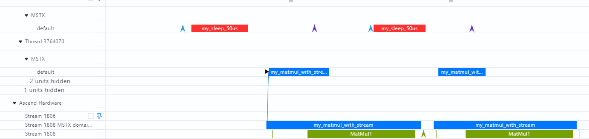

# MSTX 用户自定义打点

在大集群场景下，完整 Profiling 数据量通常较大、分析链路也更复杂。MSTX（MindStudio Tools Extension API）能够通过自定义打点记录关键函数、关键阶段和特定时间段的开始与结束时间，用于快速定界性能问题。

## 开启方式

通过 `experimental_config.mstx` 开启打点能力，常见配置如下：

```python
import torch
import torch_npu


experimental_config = torch_npu.profiler._ExperimentalConfig(
    profiler_level=torch_npu.profiler.ProfilerLevel.Level_none,
    mstx=True,
    export_type=[torch_npu.profiler.ExportType.Db],
)

with torch_npu.profiler.profile(
    schedule=torch_npu.profiler.schedule(wait=1, warmup=1, active=2, repeat=1, skip_first=1),
    on_trace_ready=torch_npu.profiler.tensorboard_trace_handler("./result"),
    experimental_config=experimental_config,
) as prof:
    for step in range(steps):
        train_one_step()
        prof.step()
```

## 打点方式

可使用 `torch_npu.npu.mstx.mark`、`range_start`、`range_end`、`mstx_range` 等接口在脚本中标记关键阶段。

### 只记录 Host 侧 range 耗时

```python
id = torch_npu.npu.mstx.range_start("dataloader", None)
dataloader()
torch_npu.npu.mstx.range_end(id)
```

### 在计算流上打点

```python
stream = torch_npu.npu.current_stream()
id = torch_npu.npu.mstx.range_start("matmul", stream)
torch.matmul()
torch_npu.npu.mstx.range_end(id)
```

### 示例
在代码中使用MSTX添加自定义打点，采集profiling数据后，可通过MindStudio Insight可视化工具展示，如图1所示。
```python
for i in range(2):
    torch_npu.npu.mstx.mark("code_start")
    # 获取host耗时
    range_id1 = torch_npu.npu.mstx.range_start("my_sleep_50us")
    time.sleep(0.00005)
    torch_npu.npu.mstx.range_end(range_id1)
    # 获取host和device耗时
    range_id2 = torch_npu.npu.mstx.range_start("my_matmul_with_stream", stream= range_stream)
    result_npu = torch.matmul(a, b)
    torch_npu.npu.mstx.range_end(range_id2)
    torch_npu.npu.mstx.mark("code_end")
```


<div style="text-align: center;">
<strong>图1</strong> mstx数据文件可视化呈现
</div>

## Domain 过滤

可以通过 `mstx_domain_include` 或 `mstx_domain_exclude` 控制输出哪些 domain 的打点数据，两个参数互斥，若同时配置则仅 `mstx_domain_include` 生效。

## 默认采集内容

mstx 默认会采集通信算子、`dataloader` 和 `save_checkpoint` 等关键阶段的数据。除此之外，也可以结合 `mstx_torch_plugin` 获取 `dataloader`、`forward`、`step`、`save_checkpoint` 四个关键阶段的性能数据。

## 适用场景

- 需要对关键函数或关键阶段快速定界。
- 需要查看自定义打点从框架侧到 CANN 层再到 NPU 侧的执行调度情况。
- 大集群场景下希望减少全量 Profiling 的分析负担。
