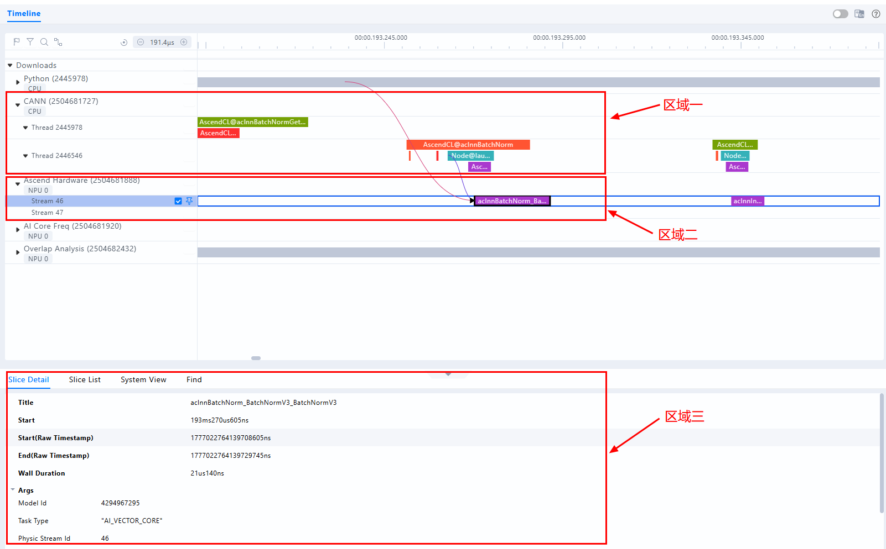
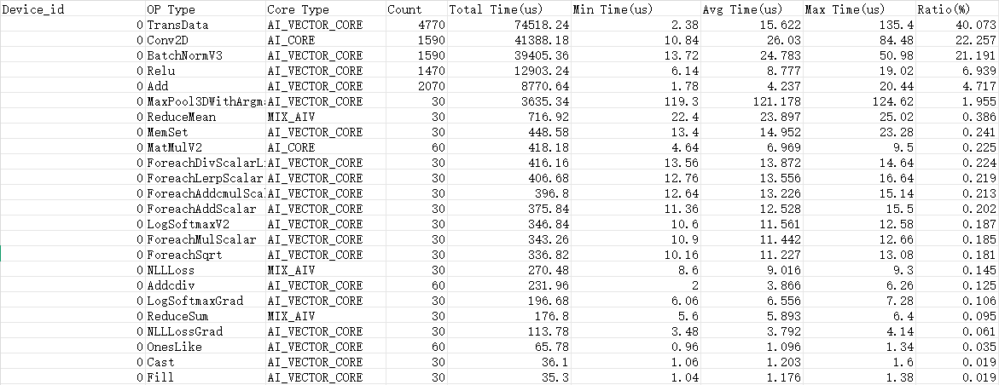
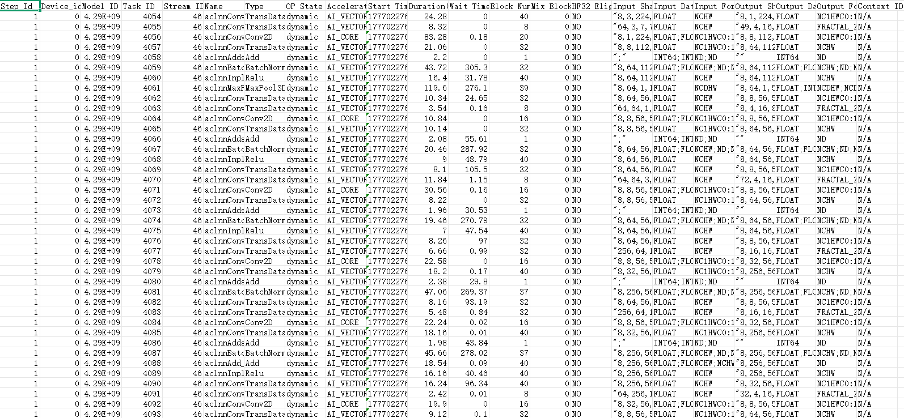

# 快速入门

本教程旨在帮助你快速上手Ascend Pytorch Profiler工具，提供一个最小示例，涵盖采集、解析性能数据完整流程。 

## 第一步：安装工具

```bash
pip install torch torch_npu
```

## 第二步：生成样例 profiling 数据

在训练脚本内添加如下示例代码进行性能数据采集参数配置。

```angular2html
import torch
import torch_npu

...

experimental_config = torch_npu.profiler._ExperimentalConfig(
    export_type=[
        torch_npu.profiler.ExportType.Text,
        torch_npu.profiler.ExportType.Db
        ],
    profiler_level=torch_npu.profiler.ProfilerLevel.Level1,
    aic_metrics=torch_npu.profiler.AiCMetrics.AiCoreNone,
)
with torch_npu.profiler.profile(
    activities=[
        torch_npu.profiler.ProfilerActivity.CPU,
        torch_npu.profiler.ProfilerActivity.NPU
        ],
    schedule=torch_npu.profiler.schedule(wait=0, warmup=0, active=1, repeat=1, skip_first=1),
    on_trace_ready=torch_npu.profiler.tensorboard_trace_handler("./result"),
    record_shapes=False,
    profile_memory=False,
    with_stack=False,
    with_modules=False,
    with_flops=False,
    experimental_config=experimental_config) as prof:

    for step in range(steps):
        train_one_step(step, steps, train_loader, model, optimizer, criterion)
        prof.step()    # 与schedule配套使用
```

首次体验时，推荐直接使用附录中的 [train_sample.py](#附录) 生成 Ascend PyTorch Profiler 样例数据。该脚本通过 `torch_npu.profiler` 的`step()`接口采集 ResNet50 训练任务性能数据，并将结果输出至 `./result` 目录。

```bash
python train_sample.py
```

运行后，终端会打印类似如下信息：

```text
[INFO] Using device: npu:0
[Epoch 1/5] Average Loss: 2.5849
[Epoch 2/5] Average Loss: 2.5526
[Epoch 3/5] Average Loss: 2.2174
[Epoch 4/5] Average Loss: 2.0562
[2026-03-24 03:44:40] [INFO] [3956593] profiler.py: Start parsing profiling data in sync mode at: /home/result/msprof_3954534_20260324034427358_ascend_pt
[2026-03-24 03:44:49] [INFO] [3956641] profiler.py: CANN profiling data parsed in a total time of 0:00:08.090306
[2026-03-24 03:44:53] [INFO] [3956593] profiler.py: All profiling data parsed in a total time of 0:00:12.392744
[Epoch 5/5] Average Loss: 1.9166
```

## 第三步：查看与分析性能数据

运行训练或在线推理任务完成后，会在`result`目录下生成XXX_ascend_pt目录，存放自动解析后的性能数据。

   ```ColdFusion 
    XXX_ascend_pt
    ├── ASCEND_PROFILER_OUTPUT   // 解析后的性能数据
    │    ├── analysis.db   
    │    ├── api_statistic.csv 
    │    ├── ascend_pytorch_profiler.db
    │    ├── kernel_details.csv
    │    ├── operator_details.csv
    │    ├── op_statistic.csv
    │    ├── step_trace_time.csv
    │    ├── ...
    │    └── trace_view.json
    ├── FRAMEWORK   // 框架侧性能原始数据，用户无需关注
    ├── PROF_000001_20260424092602791_02445978DJECPLIB
    │    └── device_0  // Device侧性能原始数据，用户无需关注
    │    └── host // Host侧性能原始数据，用户无需关注
    └── profiler_info.json   // 性能数据采集配置信息
    └── profiler_metadata.json   // 性能数据相关的元数据
   ```

### Timeline数据可视化

建议使用MindStudio Insight可视化工具加载XXX_ascend_pt文件夹进行如下操作：

* 定位耗时较长的 API、算子及任务流
* 通过 HostToDevice 连线分析下发关系

MindStudio Insight工具详细介绍请参见《[MindStudio Insight工具用户指南](https://gitcode.com/Ascend/msinsight/blob/26.0.0/docs/zh/user_guide/overview.md)》。


<div style="text-align: center;">
<strong>图1</strong> trace_view.json文件可视化呈现
</div>

> 区域1：CANN层数据，主要包含Runtime等组件以及Node（算子）的耗时数据。   
> 区域2：底层NPU数据，主要包含Ascend Hardware下各个Stream任务流的耗时数据和迭代轨迹数据、昇腾AI处理器系统数据等。   
> 区域3：展示timeline中各算子、接口的详细信息（单击各个timeline色块展示）。  

### Summary数据分析

#### op_statistic.csv

op_statistic.csv文件按照算子类型（Op Type）归类，给出各类算子的调用总时间、总次数等，按照Total Time排序，找出耗时最长的算子类型，分析这类算子是否有优化空间。


<div style="text-align: center;">
<strong>图2</strong> op_statistic.csv文件示例
</div>

#### kernel_details.csv

kernel_details.csv文件包含算子的输入输出形状、PMU 等详细信息，其中Task Duration字段记录算子耗时。可按Task Duration排序定位高耗时算子，也可按Task Type排序查看不同核（AI Core和AI CPU）上的耗时分布，从而识别出高耗时算子，并进一步分析其优化空间。


<div style="text-align: center;">
<strong>图3</strong> kernel_details.csv文件示例
</div>

## 第四步：进阶参考

- 需要理解参数和调用方式时，继续阅读 [profile 接口采集](../user_guide/profile_api.md)。
- 需要手动解析结果时，阅读 [离线解析](../user_guide/offline_analyse.md)。

## 附录

train_sample.py:  ResNet50 训练示例，使用 `torch_npu.profiler` 采集性能数据

```python
import torch
import torch.nn as nn
import torch.optim as optim
import torchvision.models as models
from torchvision.models import ResNet50_Weights
import torch_npu


class ResNet50:
    def __init__(self, num_classes=1000, device=None):
        # Automatically choose the device: NPU > CUDA > CPU
        if device is None:
            if hasattr(torch, 'npu') and torch.npu.is_available():
                self.device = torch.device("npu:0")
            else:
                self.device = torch.device("cuda:0" if torch.cuda.is_available() else "cpu")
        else:
            self.device = torch.device(device)
        print(f"[INFO] Using device: {self.device}")

        # Load ResNet50 (with pretrained weights)
        self.model = models.resnet50(weights=ResNet50_Weights.IMAGENET1K_V1)
        if num_classes != 1000:
            self.model.fc = nn.Linear(self.model.fc.in_features, num_classes)
        self.model = self.model.to(self.device)

    def train(self, data_loader, epochs=5, lr=1e-4, freeze_backbone=False):
        """
        Simple training function.
        :param data_loader: torch.utils.data.DataLoader returning (images, labels)
        :param epochs: Number of epochs to train for
        :param lr: Learning rate
        :param freeze_backbone: Whether to freeze the ResNet backbone, only training the classification head
        """
        # Optionally freeze the backbone (useful for fine-tuning)
        if freeze_backbone:
            for param in self.model.parameters():
                param.requires_grad = False
            for param in self.model.fc.parameters():
                param.requires_grad = True

        # Optimize only parameters that require gradients
        params_to_optimize = [p for p in self.model.parameters() if p.requires_grad]
        optimizer = optim.Adam(params_to_optimize, lr=lr)
        criterion = nn.CrossEntropyLoss().to(self.device)

        self.model.train()

        # torch_npu.profiler experimental configs
        experimental_config = torch_npu.profiler._ExperimentalConfig(
            export_type=[
                torch_npu.profiler.ExportType.Text,
                torch_npu.profiler.ExportType.Db
                ],
            profiler_level=torch_npu.profiler.ProfilerLevel.Level1,
            aic_metrics=torch_npu.profiler.AiCMetrics.AiCoreNone,
        )

        with torch_npu.profiler.profile(
            activities=[
                torch_npu.profiler.ProfilerActivity.CPU,
                torch_npu.profiler.ProfilerActivity.NPU
                ],
            schedule=torch_npu.profiler.schedule(wait=0, warmup=1, active=3, repeat=1, skip_first=0),
            on_trace_ready=torch_npu.profiler.tensorboard_trace_handler("./result"),
            record_shapes=False,
            profile_memory=False,
            with_stack=False,
            with_modules=False,
            with_flops=False,
            experimental_config=experimental_config) as prof:
                for epoch in range(epochs):
                    total_loss = 0.0
                    for inputs, labels in data_loader:
                        inputs, labels = inputs.to(self.device), labels.to(self.device)

                        optimizer.zero_grad()
                        outputs = self.model(inputs)
                        loss = criterion(outputs, labels)
                        loss.backward()
                        optimizer.step()

                        total_loss += loss.item()

                    avg_loss = total_loss / len(data_loader)
                    print(f"[Epoch {epoch + 1}/{epochs}] Average Loss: {avg_loss:.4f}")
                    prof.step()


def train():
    trainer = ResNet50(num_classes=10)
    fake_images = torch.randn(80, 3, 224, 224)
    fake_labels = torch.randint(0, 10, (80,))
    dataset = torch.utils.data.TensorDataset(fake_images, fake_labels)
    loader = torch.utils.data.DataLoader(dataset, batch_size=8, shuffle=True)
    trainer.train(loader, epochs=5, lr=1e-3, freeze_backbone=True)


if __name__ == "__main__":
    train()

```